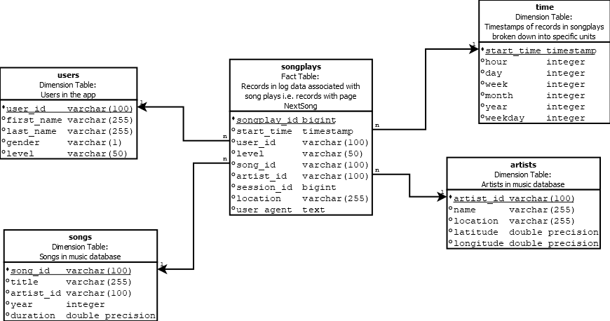

# Project 1: Song Play Analysis With RDBMS  
[](https://img.shields.io/badge/project-passed-success.svg)

## Summary
* [Schema definition](#Schema-definition)
* [How to run](#How-to-run)
* [Project structure](#Project-structure)
* [Example queries](#Example-queries)
--------------------------------------------


#### Schema definition
This is the schema of the database

How to read the schema: 
* Blank bullets are used to identify the fields that can be null <br>
* Black bullets are used to identify the fields that can not be null <br>
* If the field is underlined means that is a primary key <br>





To represent this context a ``Star schema`` has been used <br>

The songplays table is the core of this schema, is it our fact table and <br>
it contains foreign keys to four tables;
* start_time REFERENCES time(start_time)
* user_id REFERENCES time(start_time)
* song_id REFERENCES songs(song_id)
* artist_id REFERENCES artists(artist_id)

--------------------------------------------

#### How to run
First of all, you need a PostgreSQL instance up and running <br>
Here you can find the [Binary packages](https://www.postgresql.org/download/) for you preferred operating system  <br>
After downloaded the package, If you do not know to move on just follow this [Tutorial](http://www.postgresqltutorial.com/) <br>

And of course [Python](https://www.python.org/downloads/) <br>

<b> Note: </b><br>
In this example we will use user-password authorization mechanism

After installing your database on your local machine, you have to create a <br>
custom user called `student` with password `student`  <br>
and create a database called `sparkifydb`

After opening terminal session, set your filesystem on project root folder <br>
and  insert these commands in order to run the demo: <br><br>
<I> This will create our tables, this must be runned first </I> <br>
`` python create_tables.py`` <br>

<I> And this will execute our ETL process </I> <br>
`` python etl.py`` <br>

----------------------------

#### Project structure
This is the project structure, if the bullet contains ``/`` <br>
means that the resource is a folder:

* <b> /data </b> - Source of the JSON file, all these files have to be elaborated
  * <b> /log_data </b> - A folder that contains files of log files in JSON format generated by this [event simulator](https://github.com/Interana/eventsim) based on the songs in the dataset above. These simulate app activity logs from a music streaming app based on specified configurations.
  * <b> /song_data </b> -  Each file is in JSON format and contains metadata about a song and the artist of that song. The files are partitioned by the first three letters of each song's track ID
* <b> /imgs </b> - Simply a folder with images that are used in this ``md``
* <b> etl.ipynb </b> - It is a notebook that helps to know step by step what etl.py does
* <b> test.ipynb </b> - It is a notebook that helps to know if tables
  <br> are created and data are ingested correctly 
* <b> create_tables.py </b> - This script will drop old tables (if exist) ad re-create new tables
* <b> etl.py </b> - This script will read JSON every file contained in /data folder, parse them, <br> build relations though logical process and ingest data 
* <b> sql_queries.py </b> - This file contains variables with SQL statement in String formats, <br> partitioned by CREATE, DROP, INSERT statements plus a FIND query 

----------------------------

#### Example queries

<I> For strategical purposes you may want to know which is the most <br>
used user agent</I>
``` SQL
SELECT user_agent, count(user_agent) FROM songplays GROUP BY user_agent;
```

<I> For IT purposes you may want know the hour where users are more active </I>
``` SQL
SELECT count(start_time), DATE_PART('hour', start_time) from songplays group by DATE_PART('hour', start_time);
```

----------------------------
